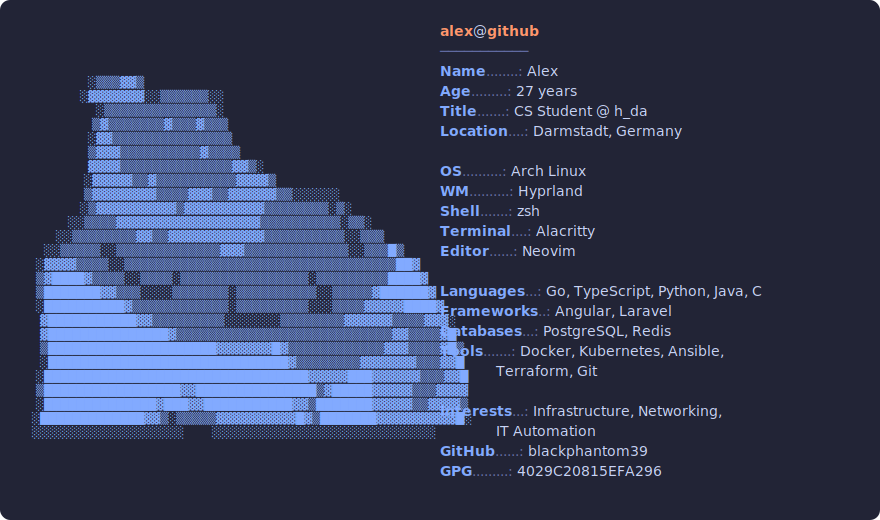

<!--
  This file is the source for README.md. README.md is generated from it by the
  Go build; edits made directly to README.md will be overwritten.

  Available template data:
    .Profile  — struct from profile.json (all fields)
    .Theme    — active theme (id, name)
    .Age      — int, computed from .Profile.Birthdate
-->
<picture>
  <source media="(prefers-color-scheme: dark)" srcset="dark.svg">
  <source media="(prefers-color-scheme: light)" srcset="light.svg">
  
</picture>

Somewhere between infrastructure, automation, and the next homelab rabbit
hole — generally curious about how things work under the hood. _(Bio is a
placeholder; will refresh once the facts in `profile.json` are up to date.)_

**GPG** &nbsp; [`4029C20815EFA296`](https://github.com/blackphantom39.gpg)
